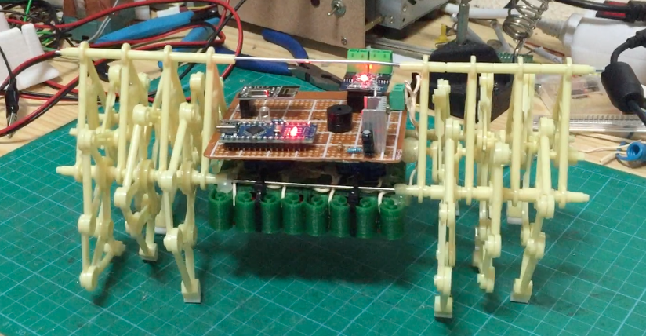

# Electronics Strandbeests

Código del proyecto. Para más detalles sobre la construcción, consultar [la Wiki](https://github.com/loreman/Strandbeest/wiki).

IMPORTANTE: Usa la librería RF24, que se puede instalar desde el propio IDE de arduino (Programa/Incluir Librería/Gestionar Liberías).

## Calibración
En el loop del código del robot hay una serie de valores numéricos que uso para establecer el umbral a partir de cuándo se entiende que estamos indicando movimiento. Es propio de mi joystick, pero podrías necesitar modificarlos a tu gusto. Puedes encontrar información sobre cómo funciona [aquí] (https://www.sparkfun.com/tutorials/272). Te será útil si vas a hacer modificaciones o adaptarlo a algún otro joystick de otro fabricante que pueda funcionar de otra manera.

## Autor
[Rafael López Verdejo](https://github.com/loreman)

## Licencia
* **Código**: [licencia GPL](https://github.com/loreman/Strandbeest/blob/master/LICENSE)
* **El resto de material**: Imágenes, textos, diagramas, vídeos... [ Creative Commons Attribution-ShareAlike 4.0 International License](http://creativecommons.org/licenses/by-sa/4.0/)

## Créditos

TMRh20, por la librería [RF24](http://tmrh20.github.io/RF24/)
